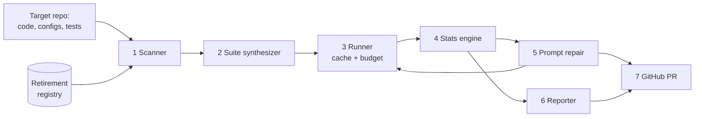

# Architecture overview

ModelBump is a pipeline of independent stages. Each stage has one job, a typed input and a typed output, so stages can be tested, evaluated and replaced on their own.

| Stage | Responsibility | Status |
|-------|----------------|--------|
| [Registry](registry.md) | Which model IDs are retired, and when | v1 (Phase 1) |
| Scanner | Find model IDs in code and config; match them against retirement dates | Planned (Phase 2) |
| Suite synthesizer | Build regression test cases and oracles from the target repo | Planned (Phase 5) |
| Runner | Call models with caching, retries and a cost budget | Planned (Phase 3) |
| Stats engine | Decide REGRESSED / EQUIVALENT / INCONCLUSIVE per test case | Planned (Phase 4) |
| Prompt repair | Find prompt edits that fix regressions safely | Planned (Phase 6) |
| Reporter / GitHub | Produce reports and open the upgrade PR | Planned (Phase 7) |

Each stage gets its own page here when it is built.
