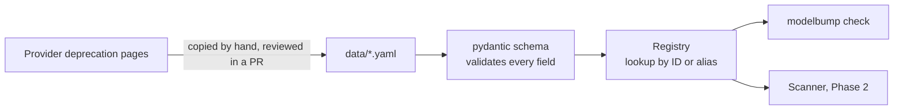

# Retirement registry

**Job:** answer "is this model ID being retired, and when?"

**Code:** `src/modelbump/registry/` · **Data:** `src/modelbump/registry/data/*.yaml` · **Decision:** [ADR 0006](../adr/0006-retirement-registry-format.md)



## Data format

```yaml
provider: anthropic
source_url: https://platform.claude.com/docs/en/about-claude/model-deprecations
retrieved: 2026-10-08
models:
  - id: claude-3-haiku-20240307
    announced: 2026-02-19
    shutdown: 2026-04-20
    replacement: claude-haiku-4-5-20251001
```

| Field | Required | Meaning |
|-------|----------|---------|
| `id` | yes | Model ID exactly as used in API calls |
| `aliases` | no | Other IDs that point to the same model |
| `announced` | no | Day the deprecation was announced |
| `shutdown` | yes | Day API calls stop working |
| `replacement` | no | What the page recommends on the `retrieved` day |
| `notes` | no | Anything odd about this entry |

## Status rules

On a given day a model is **retired** from its shutdown day onwards, **deprecated** from its announcement day until then, and **active** before that.

## Try it

```
uv run modelbump check claude-3-haiku-20240307
```

## Coverage

| Provider | Entries | Source |
|----------|---------|--------|
| Anthropic | 20 | [Model deprecations](https://platform.claude.com/docs/en/about-claude/model-deprecations) |
| OpenAI | Next step | |
| Google | Next step | |
